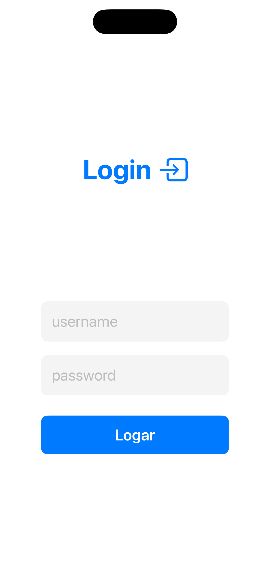
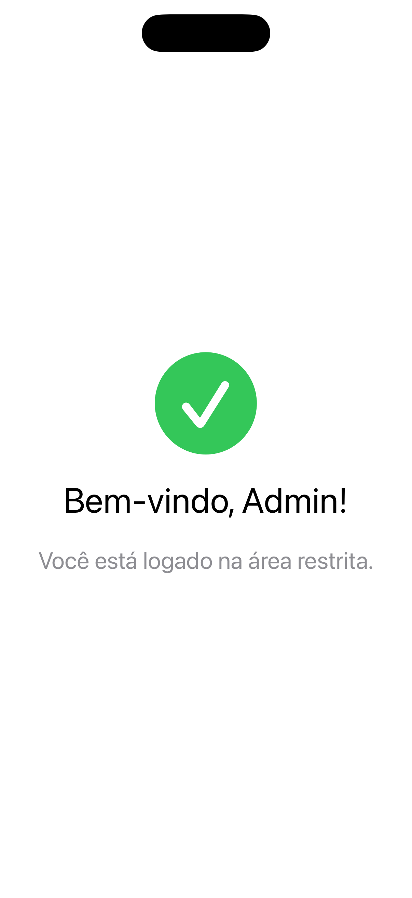
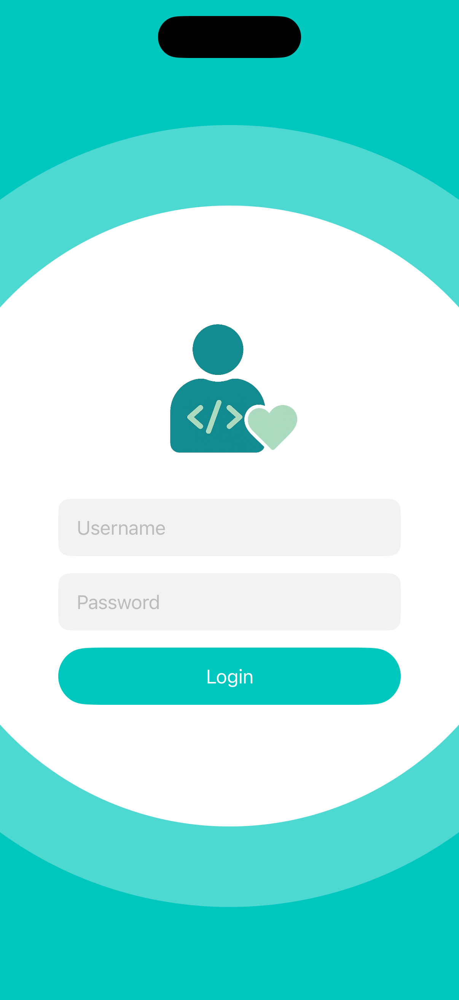
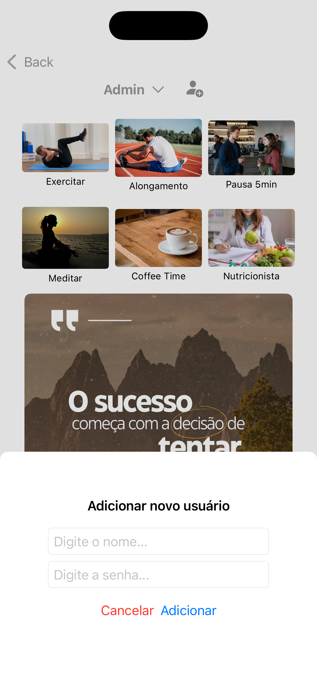
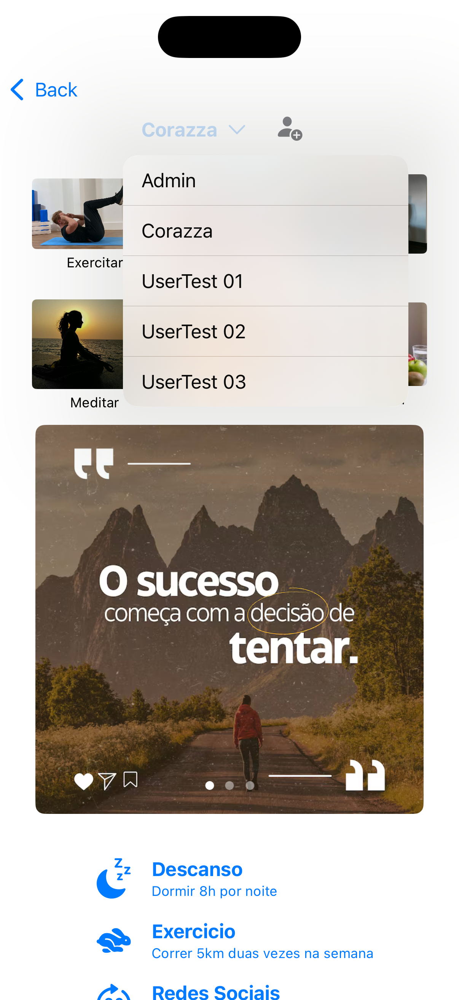
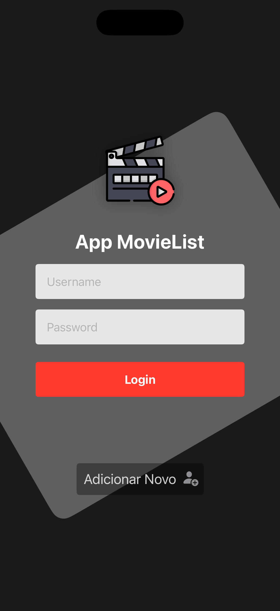
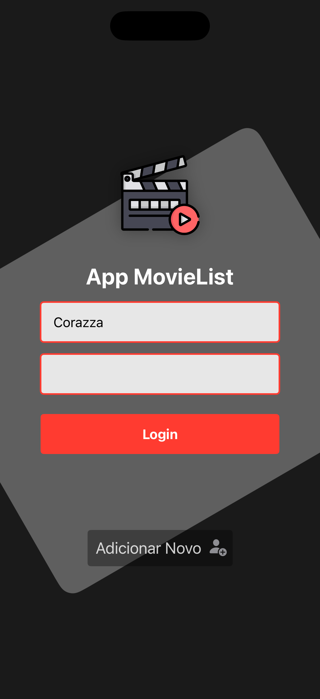
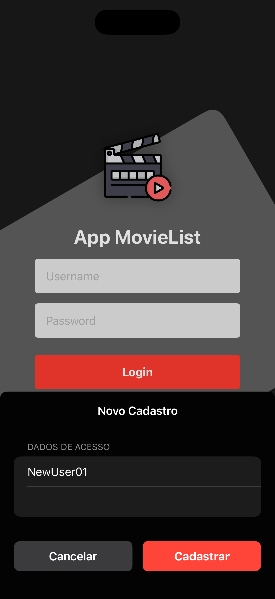
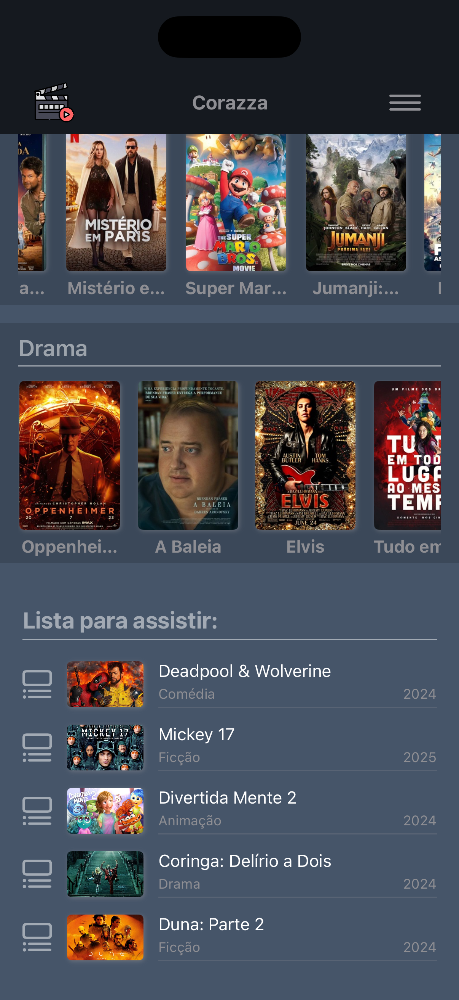
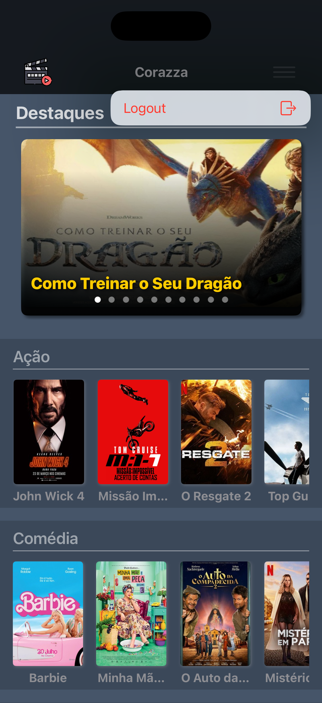

# DM126
## Desenvolvimento de Aplicativos em Swift para iOS

Este repositório armazena os exercícios práticos e códigos desenvolvidos durante a disciplina **DM126**, focado no aprendizado da linguagem **Swift** e desenvolvimento para o ecossistema Apple.

### 📚 Conteúdo

O repositório está organizado por aulas e exercícios propostos/resolvidos.

## 🚀 Aula 1: Fundamentos da Linguagem Swift [Exercicios](exercicios/exercicios_aula1)

Resumo dos principais tópicos teóricos e práticos abordados no material introdutório da disciplina.

* **Introdução ao Swift:** 
    
* **Variáveis e Constantes:**
    * **`var`**: Variáveis mutáveis.
    * **`let`**: Constantes (valores imutáveis) — o uso é encorajado sempre que possível.
    * **Inferência de Tipo**: O compilador deduz o tipo (`Int`, `String`, etc.) automaticamente, mas a tipagem explícita também é possível.
    * **Interpolação**: Inserção de variáveis em Strings usando `\(variavel)`.

* **Controle de Fluxo:**
    * **Condicionais**: Uso de `if`, `else if`, `else` e Operador Ternário.
    * **Switch**: Estrutura poderosa que suporta intervalos (`Ranges`) e Tuplas, sem necessidade de `break` explícito.
    * **Loops**:
        * `for-in`: Iteração sobre coleções ou intervalos.
        * `while`: Verifica a condição antes de executar.
        * `repeat-while`: Executa pelo menos uma vez antes de verificar (similar ao *do-while*).

* **Funções:**
    * Declaradas com `func`, suportam múltiplos parâmetros, retornos (inclusive Tuplas) e valores padrão.
    * **Inout**: Parâmetros são constantes por padrão; `inout` permite passagem por referência para alterar valores originais.

* **Opcionais (Optionals):**
    * Variáveis que podem conter um valor ou `nil` (ausência de valor).
    * **Tratamento Seguro**:
        * *Forced Unwrapping* (`!`): Arriscado se for nil.
        * *Optional Binding* (`if let`, `guard let`): Desembrulha de forma segura.
        * *Nil Coalescing* (`??`): Define um valor padrão caso seja nil.

* **Coleções:**
    * **Arrays**: Coleções ordenadas de mesmo tipo.
    * **Sets**: Coleções não ordenadas de valores únicos.
    * **Tuplas**: Grupos de valores de tipos diferentes.
    * **Dicionários**: Coleções de chave-valor (`key-value`).

* **Orientação a Objetos:**
    * **Structs (Tipos de Valor)**: Quando atribuídas a uma nova variável, é criada uma cópia. Não possuem herança. Necessitam de `mutating` para alterar propriedades em métodos.
    * **Classes (Tipos de Referência)**: Quando atribuídas, compartilham a mesma instância na memória. Suportam **Herança**, **Polimorfismo** e **Sobrescrita (`override`)**.

## 📱 Aula 2: Introdução ao SwiftUI (Tela de Login) [App Aula2](swift_ui/Aula2_Swift)

Primeiro contato com o desenvolvimento de interface gráfica utilizando o framework declarativo **SwiftUI**. O projeto prático consistiu na criação de uma tela de login.

* **Estrutura de Layout:**
    * **`VStack`**: Organização vertical dos elementos (Campos e Botão).
    * **`HStack`**: Introdução aos conceitos de empilhamento horizontal.

* **Componentes de UI:**
    * **`TextField`**: Campo de entrada de texto padrão (ex: Usuário/Email).
    * **`SecureField`**: Campo de entrada seguro para senhas (oculta os caracteres).
    * **`Button`**: Elemento interativo para submissão do formulário.
    * **`Image`**: Exibição de ícones (SFSymbols) e imagens do Assets.

* **Modificadores (Modifiers):**
    * Personalização visual encadeada (ex: `spacing:`, `.frame()`, `.textFieldStyle()`).
 
#### 📸 Screenshots

| Login | Home |
|:---:|:---:|
|||

## 🧘 Aulas 3 e 4: App Bem Estar (Home & Componentes) [App BemEstar](swift_ui/App_BemEstar)

Desenvolvimento da tela principal (`ContentView`) do aplicativo "Bem Estar", acessada após o login. A aula focou na construção de interfaces complexas combinando diferentes estruturas de layout e consumo de dados simulados (Mocks).

* **Navegação e Modais:**
    * **NavigationBar**: Implementação de uma barra de navegação personalizada.
    * **`.sheet`**: Uso de modificadores para apresentar telas modais (pop-ups) a partir da barra de navegação.

* **Layout em Grid (Serviços):**
    * **`LazyHGrid`**: Criação de um grid com rolagem horizontal.
    * **`ForEach`**: Iteração sobre o mock de `services` para renderizar dinamicamente imagens e textos de cada serviço.

* **Carrossel Interativo:**
    * **`TabView`**: Implementação de um carrossel de imagens deslizante.
    * Utilização de mocks de imagens para popular o carrossel visualmente.

* **Lista de Metas Diárias:**
    * Estrutura de lista customizada utilizando **`VStack`** combinada com **`ForEach`**.
    * Renderização dos dados provenientes do mock de `metas`, criando containers visuais para cada item da lista.

#### 📸 Screenshots

| Login | ContentView | Modal | Menu |
|:---:|:---:|:---:|:---:|
|||||

## 🏆 Trabalho Final: App [MovieList](swift_ui/App_MovieList)

Desenvolvimento de um aplicativo completo de catálogo de filmes, consolidando todos os conhecimentos adquiridos na disciplina. 
O projeto simula uma experiência de streaming (estilo Netflix/Prime Video) com foco em arquitetura de dados e interface imersiva.

* **Autenticação e Segurança:**
    * **Login e Cadastro:** Fluxo completo com tela de login e modal (`.sheet`) para registro de novos usuários.
    * **Criptografia:** Implementação do framework **CryptoKit** para armazenar senhas como Hash (SHA256), garantindo que dados sensíveis não trafeguem em texto puro.
    * **Gerenciamento de Sessão:** Uso do padrão **Singleton** (`UserManager`) para controle centralizado de usuários e validação de credenciais na memória.

* **Interface e Layout (UI/UX):**
    * **Home Screen Imersiva:** Uso de `ZStack` e temas escuros (`.preferredColorScheme(.dark)`).
    * **Carrossel de Destaques:** Implementação de `TabView` paginado com banners, aplicando `LinearGradient` para garantir legibilidade dos textos sobre as imagens.
    * **Navegação Horizontal:** Listas de categorias (Ação, Comédia, Drama) utilizando `ScrollView` horizontal combinada com `LazyHStack` para performance.
    * **Filtragem Dinâmica:** Uso de métodos de alta ordem (`.filter`) para segregar os dados do Mock por gênero automaticamente.

* **Componentização e Estado:**
    * Arquitetura modular dividida em microsserviços visuais (`MovieCard` → `CategoryRow` → `HomeView`).
    * **Custom NavigationBar:** Barra de topo personalizada exibindo dinamicamente o nome do usuário logado e menu de Logout.
    * Uso avançado de **@Binding** para transição de estados entre a tela de Login e a Home (Root View Switching).

#### 📸 Screenshots App MovieList

| Login | Login Error | Modal Sign Up | ContentView | ContentView | Logout |
|:---:|:---:|:---:|:---:|:---:|:---:|
|||||||

---

## ✒️ Autor

**Marcos Corazza**
* LinkedIn: [LinkedIn](https://linkedin.com/in/corazza)
* GitHub: [GitHub](https://github.com/mcscorazza)

---
